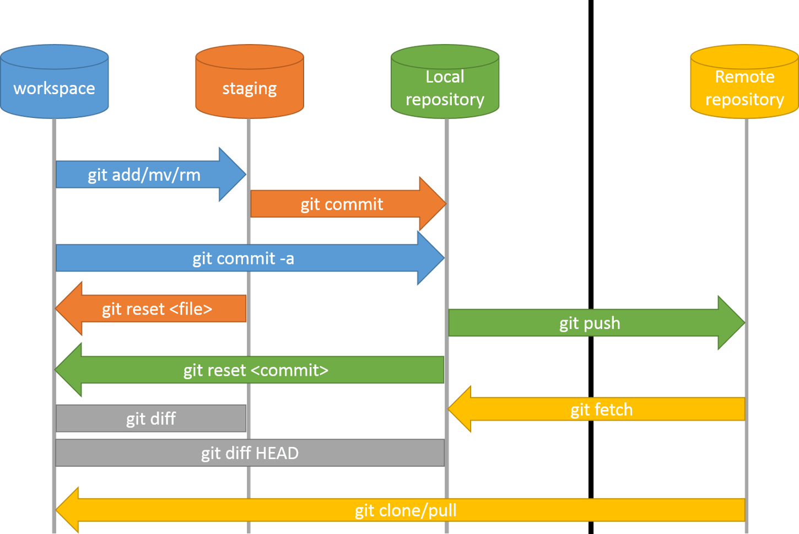

# Intro git



La versión en español de la documentación de GIT (En el libro electrónico [Fundamentos de GIT](https://git-scm.com/book/es/v1/Empezando-Fundamentos-de-Git)) favorece *staged* como **preparado**.

> Git tiene tres estados principales en los que se pueden encontrar tus archivos:

modificado (modified), 

preparado (staged).

confirmado (committed), 

y describe *staging area* como el **área de preparación**.

> [...] las tres secciones principales de un proyecto de Git:

el directorio de Git (Git directory), 

el área de preparación (staging area).

el directorio de trabajo (working directory), 

# clone

```bash
git clone https://github.com/USER_OR_ORGANIZATION/REPO_NAME.git
```

# init

```bash
mkdir name
git init 
# .git folder at the root
# If we were to remove .git, rm -rf .git/,
git branch -m master main
git remote add origin [git@github.com](mailto:git@github.com):{username}/{repositoryname}.git
git remote -v # list remotes
git push -u origin main
```

# snapshots

```bash
git status
git add -A # all files at any folder
git status
git commit -m "Add a missing bracket"
git status
git push
git status
```

# Readme

```bash
# Create and edit a readme on gitHub
```

# Sync local - remote

```bash
git fetch # get changes
git merge # apply changes
git pull # shortcut, get and apply
```

# Branches

```bash
git branch new-feature # create
git branch # list
git checkout new-feature # move
git checkout -b other-feature # shortcut create and move to
git push origin other-feature
git checkout - # back to the last branch
```

# Sync branches

```bash
# create and commit work on a branch
git checkout main # move to main
git pull # stay always sync
git merge the-branch # merge the changes
git push # save the chanegs
git branch -d the-branch # delete temporary branch

```

# Conflicts

```bash
# change the same line on GitHub and on local
git commit -a -m 'local changes'
git push # rejected !
git pull # conflicts
git status
# <<<<<<< HEAD
# our local change
# =======
# their remote code
# >>>>>>> hashcode
git commit -a -m 'manual merged changes'
git push

```

# Stash and continue

```bash
git checkout -b one-feature
git stash # save current work into a pile
git checkout -b hotfix # fix a problem
git checkout main
git merge hotfix
git checkout one-feature # back to work
git stash apply # mege changes form the pile

```

# History

```bash
git log
git log --online # condesed
git log --decorate # with references
git log --graph # branches tree
git log --stat # counts the changes

git log -3 --grep="fix" --after"2/14/21" # last 3 commits with fix after Valentines

```

# Diff

```bash
git diff # shows changes between two references
# default:  last commit vs working directory
git diff --cached # staging area vs working directory
git diff HEAD  # last commit vs staging area and working directory

git fetch
git diff origin/main # with other branch, local or remoted

git diff --stat # condensed view
```

# blame who changed

```bash
git blame onefile # who changed the file

```

# tag

```bash
git tag v1.0.0 #create a label reference
git tag # list all tags
git push --tags
git tag -a V2.0.1 -m "Some message"
git push --tags
```

# config

```bash
git config --global -l # list
git config --global user.name='Alberto Basalo'
git config --global core.editor code
git config --global -e
git config --global alias.graph 'log --graph --oneline'

.gitignore
~ .gitignore # global ignore at root folder
git config -- global core.excludesfile ~/.gitignore_global
```

[Configuración de Powerline en Terminal Windows](https://docs.microsoft.com/es-es/windows/terminal/tutorials/powerline-setup)